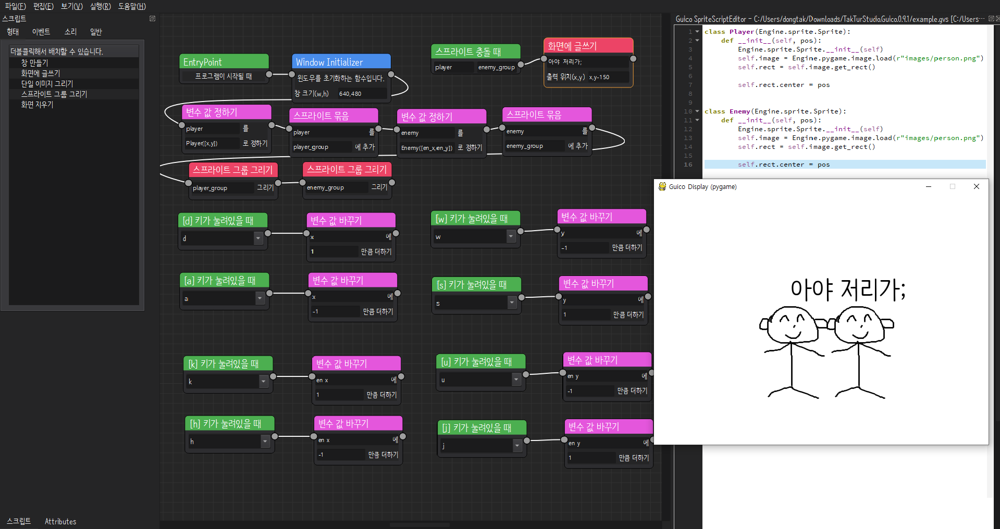

# Overview

## Get started

# Acknowledgments
The Node Editor is based on Pavel Křupala's
[Node editor in Python using PyQt5](https://gitlab.com/pavel.krupala/pyqt-node-editor-tutorials)

# License
Licensed under the [GPL v3](https://www.gnu.org/licenses/gpl.html)
